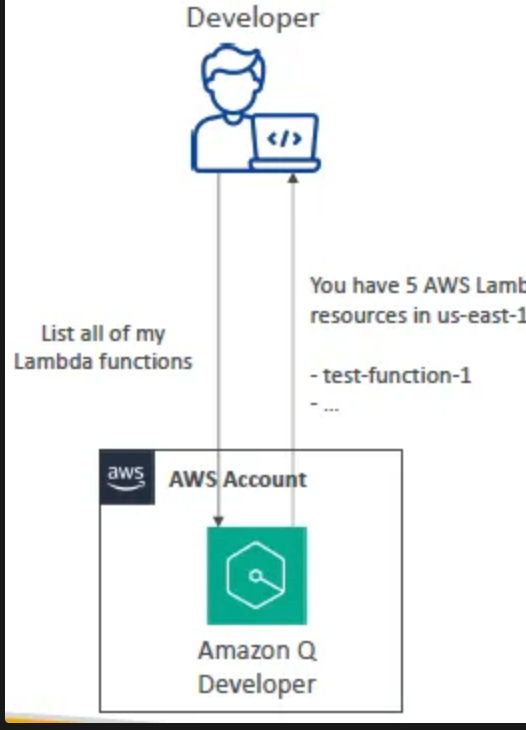

# Amazon Q

## Amazon Q Business

- Fully managed Gen-AI assistant for your employees
- Based on your company’s knowledge and data it gives the responses.
- Answer questions, provide summaries, generate content, automate tasks
- Perform routine actions (e.g., submit time-off requests, send meeting invites)
- Built on **Amazon Bedrock** - `We cannot change the underlying foundational model`.
- Data Connectors (fully managed RAG) – connects to 40+ popular enterprise data sources and can pull data from these data sources.
    - Amazon S3, `RDS, Aurora`, WorkDocs etc to pull the documents.
- Plugins – allows you to interact with 3rd party services-Jira, ServiceNow, Zendesk.
- Custom Plugins – connects to any 3rd party application using APIs
- IAM Identity Center(SSO)-
    - Can authenticate using `Microsoft Active Directory or Google Login`
    - Responses will be given by Amazon Q based on the documents that user has access to.

### Amazon Q Business – Admin Controls

- Controls and customize responses to your organisational needs.
- Admin controls == Guardrails or control on what the user can prompt or the response control given by the AI.
- Block specific words or topics as prompts by user.
- Respond only with internal information (vs using external knowledge) or external RAG's.
- Global controls & topic-level controls (more granular rules)

## PartyRock

- playground for AI based on Amazon Bedrock.
- Allows you to `experiment creating GenAI` apps with various FMs (no coding or AWS account required)
- UI is similar to Amazon Q Apps
- `No AWS account required to play around with PartyRock AI`
- Of course, Amazon Q Apps is more powerful and can use your company's internal data (PartyRock can't)
- Used to create POC mostly.

## Amazon Q Apps (Q Business)

- Create Gen AI-powered apps without coding by using `natural language`
- `Very easy to use no coding required.`
- Leverages your company’s internal data- Can make our own AI Models based on the organisational data and requirements.
- Possibility to leverage plugins (Jira)

## Amazon Q Developer

- Answer questions about the AWS documentation and AWS service selection
- Answer questions about resources in your AWS account
- Suggest CLI (Command Line Interface) to run to make changes to your account
- Helps you do bill analysis, resolve errors, troubleshooting.

- More like CHAT GPT but works on AWS Resources and Documentation it has been trained on.
- - **Code assistant** to help developers with AWS code
    - 💡 Similar to GitHub Copilot

## Amazon Q for QuickSight

- 🔧 Amazon QuickSight is used to **visualize your data**
    - With **data dashboards**
- Amazon Q integration with QuickSight → Use **natural language** to:
    - Ask questions about your data
    - Create executive summaries of your data
    - Generate and edit visuals for your dashboards

## Amazon Q for EC2
- Amazon Q integration with EC2 → use **natural language** to:
    - Ask for guidance and suggestions on what **EC2 instance types** are best suited for your workload
    - Specify workload requirements and ask for advice

## Amazon Q for AWS Chatbot

- AWS Chatbot is a way for you to deploy an AWS Chatbot in a Slack or Microsoft Teams channel that knows about your AWS account
- Troubleshoot issues, `receive notifications for alarms, security findings, billing alerts`, create support request
- You can access Amazon Q directly in AWS Chatbot.
- ‼️ Even though Amazon Q can't perform changes to your infrastructure (only suggest commands), **`AWS Chatbot is able to perform infrastructure changes!!`** (e.g. by applying suggestions from Amazon Q) 

## Amazon Q in Connect

- 🔧 Amazon Connect provides a seamless experience for your **contact center** customers and users
    - Full suite of features across **communication channels**
- Amazon Q integration with Connect → **agents get suggested responses and actions** to address customer questions
    - Quickly access knowledge articles, wikis, FAQs, and customer information