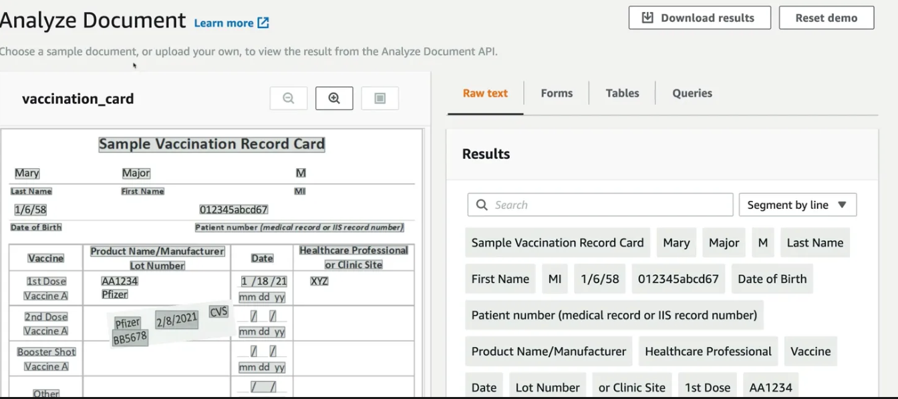
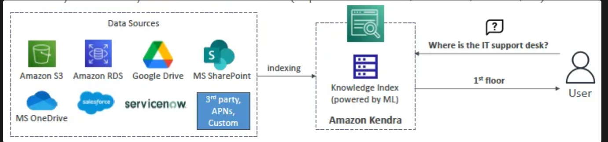
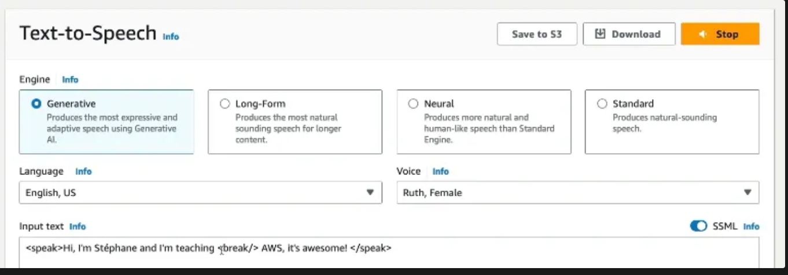

## Amazon's Hardware for AI

- GPU-based EC2 instances (P3, P4, P5…, G3…G6…) are ideal for high performant workloads like ML workloads, however they can get really pricey
- 🔧 **Trn & Inf instances** have the **lowest environmental footprint**, and also provide **significant cost savings**

AWS Trainium and AWS Inferentia are custom-designed machine learning (ML) chips developed by Amazon Web Services (AWS) to provide cost-effective and high-performance solutions for training and inference workloads. Here's a detailed comparison:

---

### **1. Purpose**
- **AWS Trainium:**
  - Specifically designed for **training machine learning models**.
  - Ideal for deep learning models like natural language processing (NLP), computer vision, and large-scale generative models.
  - Focuses on high compute throughput to handle large datasets and extensive model parameters efficiently.

- **AWS Inferentia:**
  - Optimized for **running (inference) trained ML models** in production.
  - Used to deploy models and make predictions at `low latency` and cost.
  - Designed to support high-volume, low-latency inference applications such as recommendation systems, personalization engines, and real-time predictions.

---

### **2. Use Cases**
- **AWS Trainium:**
  - Training large-scale models like GPT, BERT, and other deep learning models.
  - Supports frameworks such as PyTorch, TensorFlow, and AWS Neuron SDK for training workloads.

- **AWS Inferentia:**
  - Inference workloads like serving trained NLP models for chatbots, running image classification models, or real-time translations.
  - Supports popular ML frameworks for inference, including TensorFlow, PyTorch, and ONNX.

### **Summary Table**

| **Feature**       | **AWS Trainium**           | **AWS Inferentia**        |
|--------------------|----------------------------|----------------------------|
| **Purpose**        | Model training             | Model inference            |
| **Use Case**       | Training large ML models   | Serving trained models     |
| **Instance Type**  | Trn1                       | Inf1                       |
| **Focus**          | High training throughput   | Low-latency inference      |
| **Cost**           | Cost-efficient training    | Low-cost inference         |

---
# Amazon Managed ML Services:
### Amazon Transcribe Medical
- 💡 Enhancement of Amazon Transcribe
- Automatically convert **medical-related speech to text**
    - ❗**HIPAA compliant**
- Ability to transcribe **medical terminologies** such as:
    - Medicine names
    - Procedures
    - Conditions and diseases
- Supports both **real-time** (microphone) and **batch** (upload files) transcriptions
- Use cases:
    - Voice applications that enable physicians to dictate medical notes
    - Transcribe phone calls that report on `drug safety and side effects`
    - Integrate with Amazon Medical Comprehend
        - Transcribe patient narratives `into text that can be then analyzed by Comprehend Medical`
---
### Amazon Lex:
- Backend service for **interactive chatbots**
    - **Text or voice conversational interfaces**
    - ❗Powers the **Alexa** service!
- Two functionalities:
    1. Automatic Speech Recognition (**ASR**)
    2. Natural Language Understanding (**NLU**)
        - Lex discovers the user's **intent(s)**
- **Lex's NLU concepts**
    - **Intent**: an action the user wants to perform
        - e.g. ordering a pizza
        - Intents often fulfilled with **Lambda integration**
        - **Chain of intents:** “order a pizza” → “make it large” → “without onion”…
            - 💡 Computers have been traditionally bad at understanding chain of intents
    - **Utterance**: a phrase or way in which an intent might be said
        - Intents are trained with sample utterances
        - e.g. “Can I order a pizza”, “I want a pizza”, “Pizza, please”…
    - **Slot**: key parameters inside an utterance
        - e.g. pizza size (small/medium/large), crust (normal/cheesy)
- **Use cases: all sorts of voice bots**
    - Chatbots
    - Voice Assistants
    - Q&A Bots
    - Info/Enterprise bots
--- 
### Amazon Textract:
- **Detect, extract and `analyze text`** contained in input documents
    - Common documents: **receipts, invoices, medical records, identity documents**…
    - Outputs extracted text with **structure** and **analysis**
- Functionality
    - **Detection of text**
        - e.g. scanned invoice or receipt → detects prices, products, dates…
        - Text can be computer generated or handwritten
    - Detects **relationships in the text**
        - e.g. associated tax in the price
    - **Metadata** generation
        - e.g. where exactly in the receipt is price shown
- Features
    - Currently supported input formats: `JPEG, PNG`, PDF or TIFF
    - For most documents **synchronous** operation (real-time)
        - Large documents (e.g. big PDFs) →`asynchronous`
- **Use cases**
    - `Document analysis (names, address, birth date…)`
    - Receipt analysis (prices, vendor, line items, dates…)
    - Identity documents `(abstract fields e.g. PassportID…)`

---
### Amazon Kendra:
- **Intelligent search** service
    - Designed to mimic interacting with a human expert
    - Extracts answers from within a **document**, it searches for an answer while textract analyze the text there is a big difference.
- Supports wide range of **question types**
    - **Factoid:** who, what, where
    - **Descriptive**
        - e.g. *“how do I get my cat to stop being a jerk?”* xD
    - **Keyword**
        - e.g. *“what time is the keynote **address**?”* → “**address**” can have multiple meanings… Kendra helps determine **intent**.
- Key concepts
    - **(Knowledge) index:** searchable block of data organized in an efficient way
        - Powered by ML
        - Kendra searches for indexes when dealing with queries
    - **Data source**: where your data lives
        - Kendra connects and indexes from this location
        - e.g. AWS internal (S3, RDS…) or external (Confluence, Google Workspace, OneDrive, Salesforce, Workdocs, FSX… even Kendra Web Crawler to discover data from websites)
    - Kendra **synchronizes** data sources with indexes based on a **schedule** (keeps index current)
    - Data sources contain **documents**, which are indexed
        - **Structured** documents (FAQs)
        - **Unstructured** documents (e.g. HTML, PDFs, text…)

---
### Amazon Forecast:
- **Time-series data forecasting** service
    - ‼️ **NOT** necessarily for weather forecasting! 
    - Examples: **retail demand**, **supply chain**, staffing, energy, server capacity, web traffic…
- **Imports** from customers:
    1. **Historical data**
        - e.g. track how popular a sold item is throughout a time period
    2. **Related data** (extra contextual information)
ther can impact sales on certain clothing and umbrellas
---
### Amazon Polly:
- **Text-to-Speech (TTS)** service
    - ❗ **NO translation** done in the conversion, **same language**!
- Features
    - Integration with other services and apps
        - e.g. WordPress plugin to read WordPress articles out loud
    - Many output formats supported (MP3, PCM, Ogg Vorbis…)
    - Supports **Speech Synthesis Markup Language (SSML)** → markup tags provide additional **control** over how speech is generated
        - e.g. emphasis, pronunciation, whispering, over-exaggerated “newscaster” speaking style
    - **Lexicons:** define how to read certain specific text
        - e.g. “AWS → Amazon Web Services”
    - **Speech mark:** encode where a sentence/word starts or ends in audio
        - helpful for e.g. lip-syncing or word highlighting
    
### Amazon Translate:
- **Text translation service**
    - Powered by **neural networks**
    - Translates text to other languages, **one word at a time**
- Translation happens in two parts:
    1. **Encoder** reads **source** → outputs **semantic representation** (i.e. **meaning** of source text)
    2. **Decoder** reads meaning → writes **target language**
- **Features**
    - **Attention mechanisms** help understand context, ensure “**meaning**” is translated
    - Can **auto detect** source text language
    - Can use **terminologies**, i.e. custom dictionaries with your own custom translations for specific terms
---