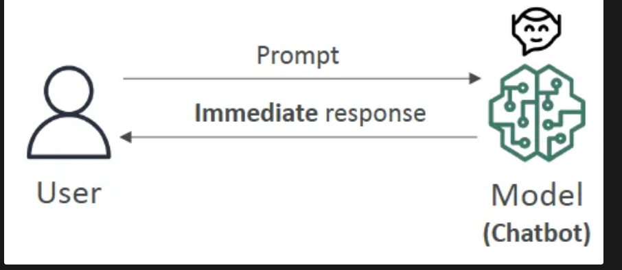
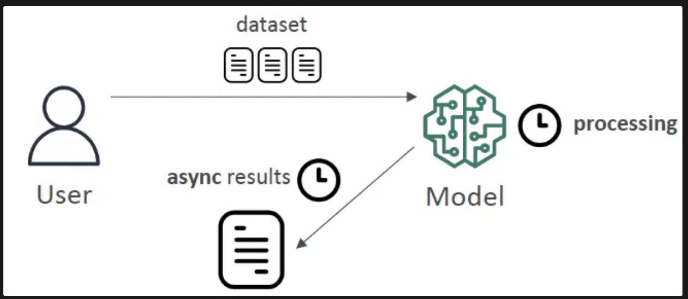
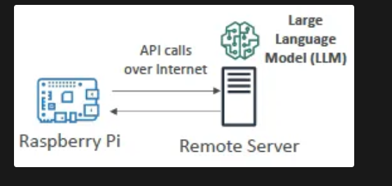

## Model Bias and Model Variance:
### Model Bias

- Difference or **error between predicted and actual value**
- **High bias** → model doesn't closely match training data → `underfitting`
- Reduce by:
    - using a more complex model
    - increasing the number of features

### Model Variance

- 🔧 **Difference of model performance** if model is trained on a different dataset of a similar distribution
- **High variance** → model very **sensitive** to changes in training data → good performance on one training dataset, bad performance on evaluation data set → overfitting
- Reduce by:
    - feature selection (less, more important features)
    - splitting into training and test datasets multiple times
## ML Inferencing:
### ML Inference - basic concept and types

- **Inference** = already trained ML model makes **prediction** (output) on new data

#### Real-Time Inferencing

- Computers have to make decisions quickly as data arrives
- **Speed (low latency)** is preferred over perfect accuracy → **synchronous** results
- Example: chatbots
- Diagram

#### Batch Inferencing

- **Large amount of data** that is analyzed all at once
- Speed of the results usually not a concern (high latency), but **accuracy** is → **asynchronous** results
- Often used for data analysis
- Diagram
    

### Inferencing at the Edge

- **Edge device:** a device with generally less computing power, close to where data is generated, where internet connections can be limited
- **Small Language Model (SLM) on an edge device**
    - Very low latency, `low compute footprint`
    - Offline capability, **local inference**
    - Example: SLM on a RaspberryPi        
- **Large Language Model (LLM) on a remote server**
    - More powerful model
    - Higher latency
    - Must be online to be accessed, **remote inference**
    - Example: RaspberryPi accesses LLM in remote server
    
# Underfitting Vs Overfitting:
### **1. Underfitting**
- **Definition:** Underfitting occurs when a machine learning model is too simple to capture the underlying patterns or complexity of the training data. 
- **Causes:**
  - Model is too simple (e.g., using a linear model for non-linear data).
  - Insufficient training time or iterations(epochs).
  - Using too few parameters in the model.
- **Symptoms:**
  - High training error.
  - High testing error (similar to training error).
- **How to Fix It:**
  - Use a more complex model (e.g., neural networks instead of linear regression).
  - Add more relevant features to the dataset.
  - Train the model for longer or tune hyperparameters.

### **2. Overfitting**
- **Definition:** Overfitting occurs when a machine learning model learns not only the patterns in the training data but `also the noise and random fluctuations`. This results in excellent performance on training data but `poor generalization to new, unseen data.`
- **Causes:**
  - Model is too complex (e.g., too many layers, neurons, or parameters).
  - Training data is `too small or not diverse enough`.
  - Model is trained for too long (over-optimized on training data).
  - Lack of regularization to control model complexity.
- **Symptoms:**
  - Very low training error.
  - `High testing error` (much larger than training error)- Tested on only the training data.
- **How to Fix It:**
  - Use simpler models or reduce the number of parameters.
  - Add more `data` or use data augmentation techniques.
  - Apply regularization techniques (e.g., L1/L2 regularization, dropout).
  - Stop training early (early stopping).

---

### **Key Differences**

| **Aspect**            | **Underfitting**                           | **Overfitting**                            |
|------------------------|--------------------------------------------|--------------------------------------------|
| **Definition**         | Model is too simple to learn the data.     | Model is too complex and learns noise.     |
| **Performance on Training Data** | Poor (high training error).               | Excellent (low training error).            |
| **Performance on Test Data**     | Poor (high test error).                  | Poor (high test error).                    |
| **Causes**             | Simplicity, insufficient features, etc.    | Complexity, noise in data, overtraining.   |
| **Solution**           | Increase model complexity, improve features. | Simplify model, regularize, add data.      |

# Random ML Words:

| ML Acronym | Name | Description | Use case |
| --- | --- | --- | --- |
| **GPT** | Generative Pre-trained Transformer | generate human text or computer code based on input prompts | language |
| **BERT** | Bidirectional Encoder Representations from Transformers | similar intent to GPT, but reads the text in two directions (helpful for translation) | language |
| RNN | Recurrent Neural Network | meant for **sequential data** such as time-series or text | time-series prediction, speech recognition, video |
| **ResNet** | Residual Network | Deep Convolutional Neural Network (CNN) used for image tasks | **images:** image recognition tasks, object detection, facial recognition |
| SVM | Support Vector Machine | ML algorithm for classification and regression | (See description) |
| WaveNet | WaveNet | model to generate raw audio waveform | Speech Synthesis |
| **GAN** | Generative Adversarial Network | models used to generate synthetic data such as images, videos or sounds that resemble the training data | Data augmentation |
| XGBoost | Extreme Gradient Boosting | an implementation of gradient boosting | (See description) |
---
# Hyperparameters:
## Hyperparameter Tuning

- 🔧 Hyperparameters are **settings** that define the model **structure**, learning **algorithm** and **process**
    - **Set before training begins**
    - Can be **tuned** across iterations to optimize model performance
- Tuning hyperparameters for better values improves model **accuracy**
    - reduces overfitting, enhances generalization

---

## Important Hyperparameters

### Learning rate

- **Size of learning steps** when updating model's weights during training
- High → faster convergence, but risks overshooting the optimal solution
- Low → more precise, but slower convergence

### Batch size

- **Number of training examples** used to update the model weights **in one iteration**
- Smaller batches → `more stable learning, but more time to compute`
- Larger batches → faster, but may lead to less stable updates

### Number of Epochs

- **Number of iterations** the model will be trained with entire dataset
- ‼️ Too few epochs can lead to `underfitting`, while too many may cause `overfitting`!

---

## What to do if ML model overfits?

- **Possible causes:**
    1. Training data size too small (does not represent all possible input values)
    2. The model trains too long on a single sample set of data (too many epochs)
    3. Model complexity is high and learns from the “noise” within the training data
- **Possible corresponding solutions:**
    1. Increase training data size, possibly with data augmentation
        - 💡 Normally a good generic solution!
    2. Early stopping the training of the model (reduce number of epochs)
    3. Adjust hyperparameters
        - ❗but you can’t “add” hyperparameters!