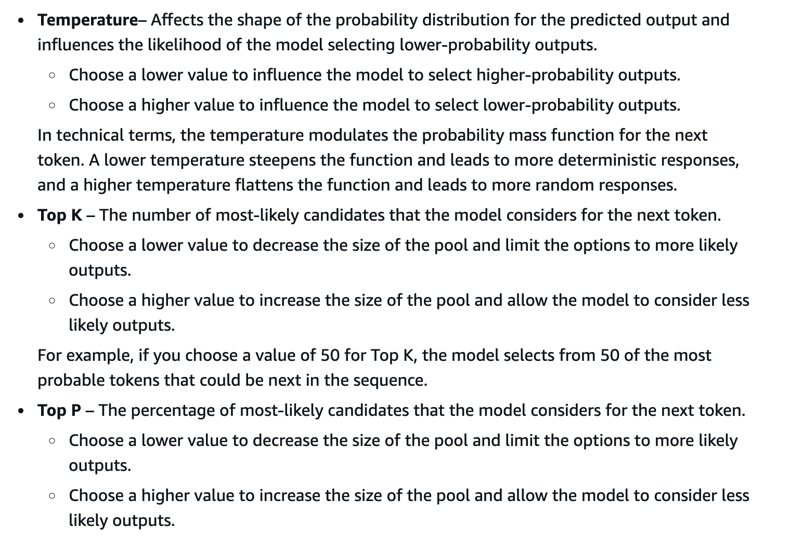
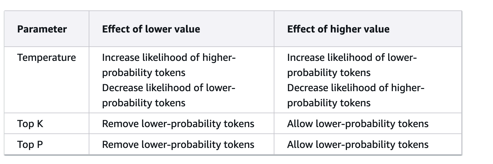

## Features
- Watermark detection for Amazon Bedrock - The watermark detection mechanism allows you to identify images generated by Amazon Titan Image Generator, a foundation model that allows users to create realistic, studio-quality images in large volumes and at low cost, using natural language prompts. With watermark detection, **you can increase transparency around AI-generated content by mitigating harmful content generation and reducing the spread of misinformation**. 

- With Knowledge Bases for Amazon Bedrock, you can give FMs and agents contextual information from your company’s `private data sources for RAG to deliver more relevant, accurate, and customized responses`, Knowledge Bases for Amazon Bedrock takes care of the entire ingestion workflow of converting your documents into embeddings (vector) and storing the embeddings in a specialized vector database. 
    - Knowledge Bases for Amazon Bedrock supports popular databases for vector storage, `including vector engine for Amazon OpenSearch Serverless, Pinecone, Redis Enterprise Cloud, Amazon Aurora (coming soon)`, and MongoDB (coming soon). If you do not have an existing vector database, **`Amazon Bedrock creates an OpenSearch Serverless vector store`** for you.
- Continued pretraining in Amazon Bedrock - In the continued pretraining process, you provide `unlabeled data to pre-train a model by familiarizing it with certain types of inputs`. You can provide data from specific topics to expose a model to those areas. The continued pretraining process will tweak the model parameters to accommodate the input data and improve its domain knowledge. You can use continued pretraining or fine-tuning for model customization in Amazon Bedrock. 

- Guardrails for Amazon Bedrock - Guardrails for Amazon Bedrock help you implement safeguards for your generative AI applications based on your use cases and responsible AI policies. It helps control the interaction between users and FMs by filtering undesirable and harmful content, redacts personally identifiable information (PII), and enhances content safety and privacy in generative AI applications. 
- Temperature - Temperature is a value between 0 and 1, and it regulates the creativity of the model's responses. Use a lower temperature if you want more deterministic responses, and use a higher temperature if you want more creative or different responses for the same prompt on Amazon Bedrock.

- Top P - Top P represents the percentage of most likely candidates that the model considers for the next token. Choose a lower value to decrease the size of the pool and limit the options to more likely outputs. Choose a higher value to increase the size of the pool and allow the model to consider less likely outputs.

- **Stop sequences** - Stop sequences specify the sequences of `characters that stop the model from generating further tokens`. If the model generates a stop sequence that you specify, it will stop generating after that sequence.
## Inference Parameters:

