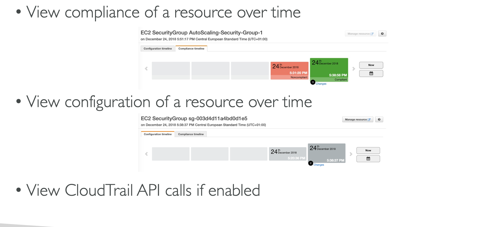
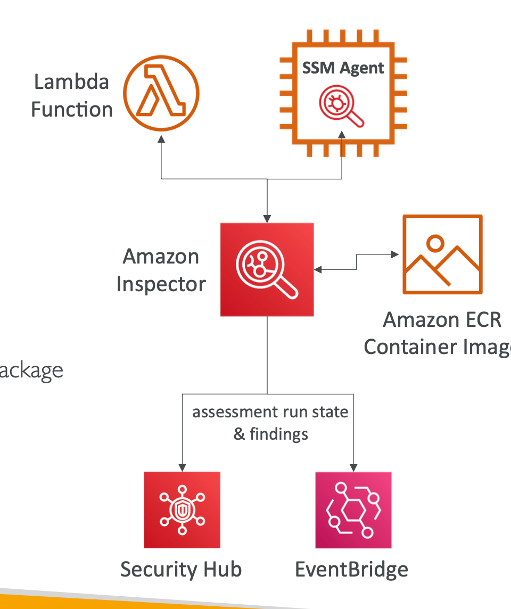
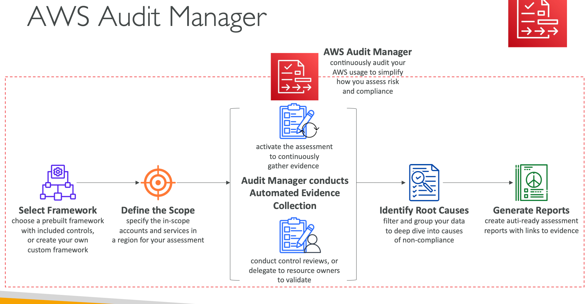

# AWS Security Services
## Macie
- Amazon Macie is a fully managed data security and data privacy service that uses machine learning and pattern matching to discover and protect your sensitive data in AWS.
- Macie helps identify and alert you to sensitive data, such as personally identifiable information (PII)
## AWS Config
- Helps with auditing and recording compliance of your AWS resources
- Helps record configurations and changes over time but does not stop the changes.
- Possibility of storing the configuration data into S3 (analyzed by Athena)
- Questions that can be solved by AWS Config:
    - Is there unrestricted SSH access to my security groups?
    - Do my buckets have any public access?
    - How has my ALB configuration changed over time?
- You can receive alerts (SNS notifications) for any changes
- AWS Config is a `per-region` service
- Can be aggregated across regions and accounts

## Amazon Inspector
- Automated Security Assessments
- For EC2 instances
    - Leveraging the AWS System Manager (SSM) agent
    - Analyze against unintended network accessibility
    - Analyze the running OS against known vulnerabilities
- For Container Images push to Amazon ECR
- For Lambda Functions: Identifies software 
vulnerabilities in function code and package dependencies
- Package vulnerabilities (EC2, ECR & Lambda) – database of CVE
- Network reachability for is possible.
- Reporting & integration with AWS Security Hub

## Cloudtrail
- Provides governance, compliance and audit for your AWS Account
- CloudTrail is enabled by default!
- Get an history of events / API calls
    - Console
    - SDK
    - CLI
    - AWS Services
- Can put logs from CloudTrail into CloudWatch Logs or S3
- A trail can be applied to `All Regions (default)` or a single Region.
## AWS Artifact

- Portal that provides customers with on-demand access to AWS compliance documentation 
- Artifact Reports - Allows you to download AWS security and compliance documents from third-party auditors, like AWS ISO certifications, Payment
Card Industry (PCI), and System and Organization Control (SOC) reports.
- On-demand access to security compliance reports of `Independent Software Vendors (ISVs)`
    - AWS Artifact can notify users when new `compliance reports are available,`.
- ISV compliance reports will only be accessible to the AWS customers` who have been granted access to AWS Marketplace`

## AWS Audit Manager
- Assess risk and compliance of your AWS workloads
- Continuously audit AWS services usage and prepare audits
- Prebuilt frameworks include:
    - CIS AWS Foundations Benchmark 1.2.0 & 1.3.0
    - General Data Protection Regulation (GDPR),
    - Health Insurance Portability and Accountability Act (HIPAA)
    - Payment Card Industry Data Security Standard (PCI DSS) v3.2.1
- Service Organization Control 2 (SOC 2)
- Generates reports of compliance

## Trusted Advisor
- No need to install anything – high level
AWS account assessment
- Analyze your AWS accounts and provides recommendation on 6 categories:
    - Cost optimization
    - Performance
    - Security
    - Fault tolerance
    - Service limits
    - Operational Excellence
